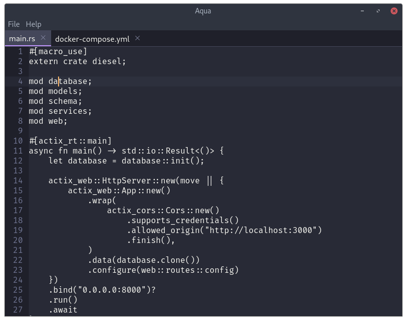

Aqua
====

[](https://github.com/FelipeRosa/aqua/blob/master/LICENSE.md)
[](https://circleci.com/gh/FelipeRosa/aqua)
[](https://codecov.io/gh/FelipeRosa/aqua)

Aqua is a text editor for the Rust programming language. Currently under development.



Usage
=====

```
$ git clone git@github.com:FelipeRosa/aqua.git
$ cd aqua
$ npm i
$ npx webpack
$ npm start
```

Roadmap
=======

- [ ] Basic text editing features (modify text, open files, save files, copy/paste, undo/redo, etc.)
- [ ] Rust syntax highlighting
- [ ] Rustfmt integration
- [ ] Cargo integration
- [ ] Git integration

See issues and projects for more details.
